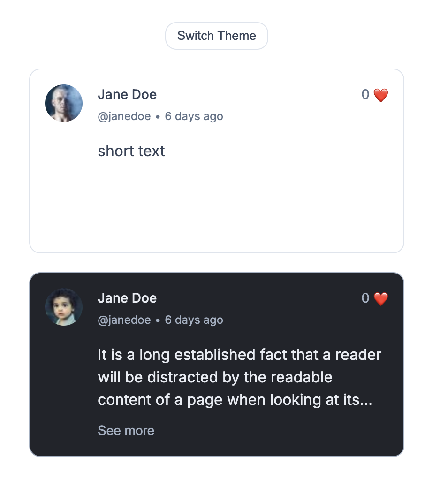

# `<social-post>` Web Component

A custom reusable social media post component (similar to Twitter or Facebook post)  
built with **Vanilla JavaScript**, **Web Components**, and **Vanilla CSS**.

Encapsulated via **Shadow DOM**, themeable (light/dark), accessible, and responsive — with bonus features.

---

## ✨ Features

✅ Display:
- Avatar  
- Display name  
- Username / Handle  
- Timestamp  
- Post content (clamped to 3 lines)

✅ Interactions:
- Like button with animation and counter  
- “See more / See less” for long content (bonus)  
- Slot support for custom injected content (bonus)  
- Dynamic updates via JS properties  
- Optional theme toggle (light / dark) logic included

✅ Technical:
- Web Components API with `customElements.define`
- Shadow DOM encapsulation
- Accepts attributes *and* JS properties
- Responsive design (max width 400px)
- Style isolation via CSS custom properties
- Fully standalone — **no frameworks, no libraries**

---

## 🖼️ Demo



---

## 🏗️ Folder Structure

```plaintext
/components/SocialPost/
│
├── SocialPost.js            # Core Web Component definition
├── template.js              # HTML template string
├── style.js                 # CSS styles (scoped inside shadow DOM)
├── constants.js             # Shared config – themes, defaults
├── themeToggle.js           # logic to toggle light/dark
├── utils.js                 # (Optional) utility helpers
```

---

## 🧪 How to Run Locally

1. Clone the repo  
   ```bash
   git clone https://github.com/yonimoshe/social-post-component.git
   cd social-post-component
   ```

2. Open `index.html` directly in your browser  
   - or use [Live Server](https://marketplace.visualstudio.com/items?itemName=ritwickdey.LiveServer) in VS Code for auto-refresh

---

## 🛠️ Tech Stack

- Vanilla JavaScript (ES Modules)
- Web Components API
- Shadow DOM
- HTML Custom Elements
- Google Fonts (`Inter`)
- CSS Variables for theming

---

## 📈 Future Improvements

- Support global theme switching (not just per-component)
- Add accessibility (ARIA labels where relevant)
- Improve date formatting (e.g., "2h ago") using `date-fns` (if allowed)
- Add tests (Jest or Web Test Runner, if relevant)

---

## 📝 Author Notes

This implementation follows the assignment closely:

- One light post and one dark post were added as per requirements
- The “See more” feature and theme switcher were implemented as **bonus**
- JS properties and attribute handling were both supported
- The code was split into small, reusable, modular files for clarity and scalability
- Inline utility (`applyThemeToHost`) allows future global theming if desired

Thanks for reviewing! 🙌
